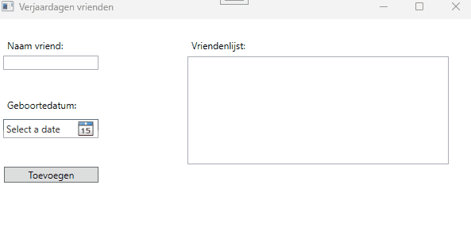

# Verjaardagen vrienden
In deze oefening gaan we een lijst van vrienden bijhouden met hun geboortejaar.
Indien het vandaag de verjaardag is van één (of meer) van onze vrienden maken we dit kenbaar in onze lijst.

In deze oefening behandelen we het volgende;

- aanmaken van een klassebibliotheek (class library)
- aanmaken van een klasse (class)
- aanmaken van **public fields** bij een klasse
- aanmaken van een public method in een klasse.

Hieronder vind je een voorbeeld van de applicatie:

## Layout
De layout is reeds voorzien en de controls hebben allen reeds een naam gekregen;

- Textbox (`txtName`): hier vullen we de naam in van onze vriend of vriendin
- Datepicker (`dpBirthday`): hier selecteren we de geboortedatum van onze vriend of vriendin.
- Button (`btnSubmit`): we maken een instantie (een object) van de klasse Friend en voegen deze toe aan een collectie in het geheugen die op zijn beurt uitgelezen wordt en getoond wordt in een listbox.
- Listbox (`lstFriends`): We tonen alle vrienden met hun geboortedatum en of het al of niet feest is (m.a.w. of het vandaag hun verjaardag is of niet)

Zie onderstaand voorbeeld:

## Uitwerking oefening
Aangezien dit de eerste oefening is in het hoofdstuk Klassen en objecten zullen we stap voor stap beschrijven wat er moet gebeuren.

### Aanmaken klassenbibliotheek
- Klik rechts op de **solution** (*en dus niet op het WPF-project*) en kies voor **Add --> New project...**
- Kies in het dialoogvenster voor **Class Library**. Eventueel zal je even moeten zoeken, dit kan in het tekstveld in het dialoogvenster. **OPGEPAST! Zorg ervoor dat je de Class Library kiest voor C# en bijvoorbeeld niet Visual Basic of een andere programmeertaal!**
- Geef nu een naam voor dit nieuw project, in dit geval bijvoorbeeld `Pra.Classes.PublicFields.BirthdayFriends.Core`. We kiezen hier voor de suffix **.Core** omdat we zo het onderscheid willen maken tussen onze klassenbibliotheek (.Core) en onze WPF-applicatie (.Wpf).
- De locatie voor deze klassenbibliotheek mag blijven, deze gaan we niet aanpassen.
- Kies het **Framework**; kies hiervoor de .NET versie die werd afgesproken. Indien je dit niet zou weten, vraag dit dan even na aan de lector(en) .
- Daarna kan je de klassenbibliotheek aanmaken en zal deze toegevoegd worden aan je solution.
- Je zal merken dat hier reeds een klasse aanwezig is met de naam `Class1.cs`. **Deze klasse mag je gerust verwijderen.** We gaan straks onze eigen klasse aanmaken.

### Klasse Friend
- Klik rechts op je net aangemaakt **Core** project en kies voor **Add --> Class..**
- Geef je klasse de naam **Friend**. De extensie van een klasse (`.cs`) hoef je niet te voorzien in de naamgeving, die wordt automatisch aangemaakt voor ons (omdat we gekozen hebben om een Class aan te maken via Add --> Class).
- Maak deze klasse public

### Fields bij de klasse Friend
- Voorzie nu twee fields in deze klasse Friend
- `public string name`: In dit field houden we de naam bij van onze vriend(in)
- `public DateTime birthDay`: In dit field houden we de geboortedatum bij van onze vriend(in)

### Controleren of het vandaag een verjaardag is van onze vriend(in)
Aangezien de verjaardag (field `birthDay`) van een vriend een kenmerk is van een vriend (klasse `Friend`), zullen we dan ook de controle of deze vriend vandaag al dan niet jarig is voorzien bij de klasse `Friend`.
Voorzie hiervoor een methode in de klasse `Friend` en geef dus volgende signatuur `bool CanWeCelebrate()`.

In deze methode voorzie je een implementatie die controleert of de dag en de maand (we houden geen rekening met het jaar) van de geboortedatum gelijk is aan de dag en maand van vandaag.
Door middel van een `bool` return type geven we aan of het vandaag de verjaardag is van onze vriend(in) of niet.

Deze methode zullen we `public` moeten maken zodanig dat deze buiten de klasse `Friend` aangesproken kan worden.

### Aanmaken nieuwe vriend(in) met geboortedatum
- Zorg ervoor dat bij het drukken op de knop **Toevoegen** er een instantie(object) aangemaakt wordt van de klasse `Friend` en dat de naam en de geboortedatum uitgelezen wordt uit de controls en toegekend worden aan de respectievelijke fields van je object.
- Voeg dit object toe aan een collectie
- Toon deze collectie in de listbox zoals afgebeeld

### Valideer de input van de gebruiker
Vergeet de input van de gebruiker niet te valideren:
- Controleer of de gebruiker wel een naam heeft ingevuld
- Controleer of de gebruiker wel een datum heeft ingevuld
