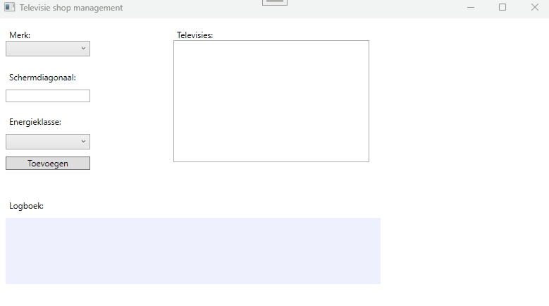
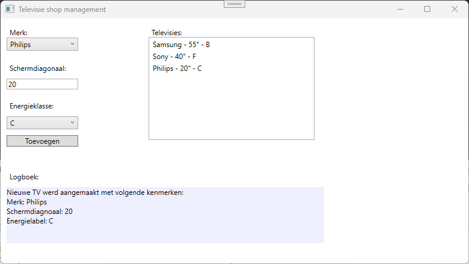

# Televisie shop

In deze oefening gaan we een shop simuleren die een lijst van televisies bijhouden met enkele van hun kenmerken.

In deze oefening behandelen we het volgende;

- aanmaken van een klassebibliotheek (class library)
- aanmaken van een klasse (class)
- aanmaken van **private fields** bij een klasse
- uitlezen van de waarden van de private fields met **Get en Set methoden**
- aanmaken van public methods in een klasse.
- valideren parameters binnen methodes van een klasse

Hieronder vind je een voorbeeld van de applicatie:



## Layout

De layout is reeds voorzien en de controls hebben allen reeds een naam gekregen;

- Combobox (`cmbBrands`): deze combobox vullen we op met enkele merknamen
- Textbox (`txtScreenSize`): hier vullen we schermdiagonaal in van onze televisie
- Button (`btnCreate`): we maken een instantie (een object) van de klasse Television en voegen deze toe aan een collectie in het geheugen.
- Listbox (`lstTelevisions`): We tonen alle televisies met hun kenmerken
- Combobox (`cmbEnergyLabel`): deze combobox vullen we op met energielabels van A t.e.m. F
- TextBlock (`tbkLog`): deze textblock vullen we op met een samenvatting van de laatst aangemaakte televisie

Zie onderstaand voorbeeld:



## Uitwerking oefening

### Aanmaken klassenbibliotheek

- Klik rechts op de **solution** (_en dus niet op het WPF-project_) en kies voor **Add --> New project...**
- Kies in het dialoogvenster voor **Class Library**. Eventueel zal je even moeten zoeken, dit kan in het tekstveld in het dialoogvenster. **OPGEPAST! Zorg ervoor dat je de Class Library kiest voor C# en bijvoorbeeld niet Visual Basic of een andere programmeertaal!**
- Geef nu een naam voor dit nieuw project, in dit geval bijvoorbeeld `Pra.Classes.Methods.TelevisionShop.Core`. We kiezen hier voor de suffix **.Core** omdat we zo het onderscheid willen maken tussen onze klassenbibliotheek (.Core) en onze WPF-applicatie (.Wpf).
- De locatie voor deze klassenbibliotheek mag blijven, deze gaan we niet aanpassen.
- Kies het **Framework**; kies hiervoor de .NET versie die werd afgesproken. Indien je dit niet zou weten, vraag dit dan even na aan de lector(en) .
- Daarna kan je de klassenbibliotheek aanmaken en zal deze toegevoegd worden aan je solution.
- Je zal merken dat hier reeds een klasse aanwezig is met de naam `Class1.cs`. **Deze klasse mag je gerust verwijderen.** We gaan straks onze eigen klasse aanmaken.

### Klasse Television

- Klik rechts op je net aangemaakt **Core** project en kies voor **Add --> Class..**
- Geef je klasse de naam **Television**. De extensie van een klasse (`.cs`) hoef je niet te voorzien in de naamgeving, die wordt automatisch aangemaakt voor ons (omdat we gekozen hebben om een Class aan te maken via Add --> Class).

### Fields bij de klasse Television

- Voorzie nu drie fields in deze klasse Television
- `private string brand`: In dit field houden we het merk bij
- `private char energyLabel`: In dit field houden we het energielabel bij
- `private int screenSize`: In dit field houden we de schermdiagonaal bij

### Methodes bij de klasse Television

Aangezien we de waardes van deze fields zullen willen uitlezen en aanpassen zullen we de nodige **public Get en Set methodes** voorzien voor deze private fields.

#### SET Brand

Om de waarde van een merk (`brand`) in te stellen voorzien we een `public` method met de naam `SetBrand` die een parameter `brand` ontvangt van het type `string`. Deze methode zal niets retourneren dus voorzien we `void` als return type.

```csharp
public void SetBrand(string brand)
{
    this.brand = brand;
}
```

Aangezien de parameter `brand` dezelfde naam heeft als ons private field `brand` moeten we een onderscheid maken, dit doen we door gebruik te maken van het keyword `this`. We willen de waarde van de parameter toekennen aan ons private field die behoort tot deze (`this`) klasse. We spreken ons private field `brand` dus aan met `this.brand` en kennen hier de waarde van de parameter `brand` aan toe (`= brand`).

> Als de naam van de parameter anders is dan de naam van het private field moeten we geen gebruik maken van het `this` keyword, maar het kan en mag wel.

#### GET Brand

Om de waarde van het private field `brand` uit te lezen zullen we een Get-methode voorzien. Deze methode zal het datatype van dit private field retourneren, in dit geval dus `string`. Geef deze de naam `GetBrand`. Deze methode bevat geen parameters. Deze methode zal nu de waarde van het private field `brand` retourneren.

```csharp
public string GetBrand()
{
    return brand;
}
```

#### SET Energylabel

Voorzie nu zelf een Set-methode om het private field `energyLabel` een waarde te geven van een parameter uit de methode. Opgepast, het datatype van `energyLabel` is `char`

#### GET Energylabel

Voorzie nu zelf een Get-methode om de waarde het private field `energyLabel` te retourneren met deze methode. Opgepast, het datatype van `energyLabel` is `char`

#### SET Screensize

Voorzie nu zelf een Set-methode om het private field `screenSize` een waarde te geven van een parameter uit de methode. Opgepast, het datatype van `screenSize` is `int`

#### GET Screensize

Voorzie nu zelf een Get-methode om de waarde het private field `screenSize` te retourneren met deze methode. Opgepast, het datatype van `screenSize` is `int`

#### GetSummary

Methodes in klassen zijn niet enkel beperkt tot Get- en Set-methoden om enkel private fields uit te lezen. Er kunnen ook methodes voorzien worden die een ander doel hebben. Voorzie een methode met de naam `GetSummary` die een string retourneert met een samenvatting van de televisie.

Deze methode moet een soortgelijke tekst retourneren:

```text
Samsung - 55" - F
```

Deze tekst zal gebruikt worden als waarde voor een televisie in de listbox

### WPF project

- Maak een methode met de naam `CreateBrands` en voorzie hierin een implementatie om enkele merken aan te maken en deze bij te houden in een `List<string> brands`.
- Maak een methode met de naam `CreateEnergyLabels` en voorzie hierin een implementatie om de hoofdletters A t.e.m. F aan te maken en deze bij te houden in een `List<char> energyLabels`.
- Zorg er nu voor dat deze methodes uitgevoerd worden als de WPF-applicatie geladen is
- Zorg ervoor dat de inhoud van beide collecties `List<string> brands` en `List<char> energyLabels` toegekend worden als items aan de twee respectievelijke comboboxen.
- Wanneer er gedrukt op wordt op de button dien je een nieuwe instantie aan te maken van de klasse `Television`

  - Je leest de controls (merk, energielabel, schermdiagonaal) uit en geeft deze waardes mee als argument met de respectievelijke Set-methodes die we in de klasse `Television` hebben aangemaakt.
  - Je maakt gebruik van de `GetSummary` methode om de nieuwe televisie toe te voegen aan de listbox
  - Je maakt gebruik van de Get-methodes in de klasse `Television` om een tekst op te bouwen die je zal tonen in de textblock. Bijvoorbeeld:

  ```text
  Nieuwe TV werd aangemaakt met volgende kenmerken:
  Merk: LG
  Schermdiagnoaal: 60
  Energielabel: D
  ```

  Maak hiervoor eventueel gebruik van de klasse `StringBuilder`.

### Valideer de input van de gebruiker

Vergeet de input van de gebruiker niet te valideren en voorzie deze validatie zoveel mogelijk in de klasse Television. Denk hierbij aan Try/Catch/Throw.

- Controleer of de gebruiker wel een schermdiagonaal heeft ingevuld
- Controleer of schermdiagonaal een waarde heeft van minstens 1 inch en maximum 500 inch.
- Controleer of de gebruiker wel merk en energieklasse heeft aangeduid.
- Eventuele validatiefouten maak je kenbaar aan de gebruiker doormiddel van een MessageBox.


